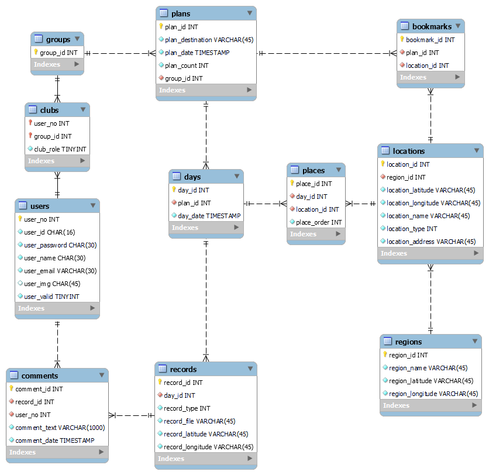

# 👪DearMyBaby

SSAFY 8기 2학기 공통 프로젝트

### 📆 진행 기간

---

2023.01.04 ~ 2023.02.16 (7주간)

### ❓ 기획 배경

여행 했던 기억을 실감나게 기록할 수 있는 애플리케이션을 개발 하려고 했습니다. 어릴 때 여행 했던 기억은 사진이나 일기와 같은 기록이 없으면 잊혀지기 마련입니다. 저희 팀은 시간이 흐르면서 점차 기억이 사라지는 것에 아쉬움을 느껴서 여행 을 입체적으로 기록하고, 보기 쉽게 모아볼 수 있는 앱을 만들어 지금 자라는 아이들에게 더욱 오래 남길 수 있는 방법을 제공하고 싶었습니다.

---

### 💡 서비스 소개

여행 계획을 편리하게, 기록을 입체적으로, 추억을 쉽게 모아보는 가족 여행 매니저입니다

### ✨ 주요 기능

---

### 1. 여행 계획

같이 여행 갈 멤버가 있는 가족 그룹을 선택하고 여행 기간과 여행지를 선택 할 수 있습니다. 그 후, 지도에서 방문할 관광지와 음식점을 검색하여 장소 바구니에 담을 수 있습니다. 장소 바구니를 클릭하면, 날짜별로 여행 루트를 직접 만들 수 있고 여행루트를 완성하고 완료하기를 누르면 여행 계획이 생성 됩니다.

### 2. 여행 기록

여행 시작일이 되면 홈 화면에서 자동으로 여행을 시작 할 수 있습니다. 여행 도중 방문한 장소에서 앱을 키고 사진을 촬영하거나 앨범에서 사진을 업로드 할 수 있습니다. 간단한 메모를 통해 좀 더 입체적인 기록을 남기세요

### 3. 여행 기록 열람

여행이 끝나고 나면 앱 내의 앨범에서 여행 기록을 모아 볼 수 있습니다. 여행 기록은 지도에서 확인 하능하고, 날짜별, 여행별로 앨범이 생성되기 때문에 다양한 방식으로 열어볼 수 있습니다.

### ​사용 방법

---

​

### 💻 기술 스택

---

| POSITION | STACK          | VERSION |
| -------- | -------------- |:-------:|
| Client   | React          | 18.2.0  |
|          | Vite           | 4.0.0   |
|          | Axios          | 1.3.2   |
| Server   | Spring Boot    | 2.7.8   |
|          | OpenJDK        |         |
|          | QueryDSL       |         |
| Database | Mysql          |         |
| Infra    | Aws            |         |
|          | Docker         |         |
|          | Docker Compose |         |
|          | Jenkins        |         |
|          | Nginx          |         |
| General  | Git            |         |
|          | Gitlab         |         |
|          | Notion         |         |
|          | Jira           |         |

### 🛠 프로젝트 구조

---

#### ERD

#### 시스템 아키텍처

### 🧞‍♂️ 팀원 소개

---

<table>

<tr>

<td height="140px" align="center"> <a href="https://github.com/DayNice">

   👑 김대희 (Front-End) </a>  </td>

<td height="140px" align="center"> <a href="https://github.com/burgerfacegirl">

    김호정 (Front-End) </a>  </td>

<td height="140px" align="center"> <a href="https://github.com/Dohyun-Kimm">

    김도현  (Front-End) </a>  </td>

<td height="140px" align="center"> <a href="https://github.com/Dohyun-Kimm">

    안승태  (Back-End) </a>  </td>

<td height="140px" align="center"> <a href="https://github.com/asng123">

    류태규  (Back-End) </a>  </td>

<td height="140px" align="center"><a href="https://github.com/Dohyun-Kimm">

 

 

박준하 

(Back-End)</a> 

</td>

</tr>

<tr>

</tr>

</table>

### 👥 협업 관리

---

### 📑 프로젝트 관련 문서

---
